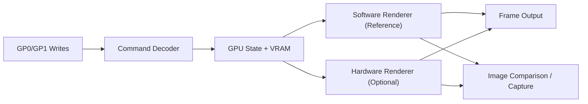
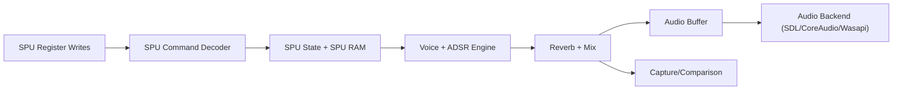

# GPU & SPU Architecture Proposal

This document proposes a GPU and SPU runtime architecture for PSXRecomp, with a focus on accuracy-first reference implementations, optional semi-accurate hardware backends, and opt-in enhancement/modding features.

## Goals

- Provide **reference-correct behavior** for PSX GPU/SPU features as a baseline.
- Allow **pluggable backends** (software + hardware) with consistent interfaces.
- Enable **optional enhancements** (texture packs, post-processing, raytracing experiments) without breaking accuracy guarantees.
- Preserve **deterministic output** for validation and regression tests.

## Non-Goals

- Achieving full performance parity with modern emulators on day one.
- Providing built-in modding tooling beyond defined extension points.
- Supporting every possible graphics enhancement feature at launch.

## Shared Runtime Concepts

### Key Interfaces

- **Command decoding**: parse raw GPU/SPU register writes into structured commands.
- **Device state**: central ownership of registers, VRAM/SPU RAM, and timing state.
- **Backend interface**: abstract hardware/driver differences, enabling software and hardware renderers/audio sinks.
- **Validation pipeline**: compare output vs. reference software implementations.

### Cross-Cutting Concerns

- **Timing/IRQ correctness**: model FIFO behavior, DMA interactions, IRQ timing.
- **Configuration and presets**: accuracy vs. performance vs. enhancement profiles.
- **Tracing and capture**: support deterministic replays for regressions.

---

# GPU Architecture

## Overview

The GPU is modeled as a deterministic, command-driven device. It consumes GP0/GP1 command packets, updates internal state, and produces framebuffer output. The architecture emphasizes a **software reference renderer** that is used for correctness validation. A **pluggable backend interface** enables optional hardware implementations, including a semi-accurate renderer targeting speed while maintaining close output parity.

### High-Level GPU Data Flow

## GPU Responsibilities

- Parse GP0/GP1 command streams into structured command objects.
- Maintain GPU state: draw modes, texture page, CLUT, blending, display timing.
- Provide VRAM read/write and framebuffer export.
- Implement rendering primitives (triangles, quads, sprites, lines, polygons).
- Enforce timing, FIFO behavior, and status register updates.

## GPU Components

### 1) Command Decoder

- Parses raw GP0/GP1 writes into structured commands.
- Handles packet lengths, immediate values, and stateful commands.
- Provides validation for malformed or unsupported packets.

### 2) GPU State & VRAM

- **Registers**: draw mode, texture page/CLUT, drawing area, offset, display config.
- **VRAM**: 1024x512 16-bit color format (plus transfer rules).
- **Timing state**: FIFO, status bits, and command processing ticks.

### 3) Software Reference Renderer (Accuracy First)

- CPU-based rasterization with PSX-accurate rules.
- Serves as **golden reference** for comparisons.
- Outputs deterministic frame captures for tests.

### 4) Hardware Renderer (Optional)

- GPU-accelerated backend via OpenGL/Vulkan/Metal.
- Uses the same command stream and GPU state.
- Supports **semi-accurate mode** to trade precision for speed while maintaining near-match to reference output.

### 5) Enhancement Pipeline (Opt-In)

- Post-processing shaders (CRT, bloom, scaling, etc.).
- Texture pack overrides (hash-based mapping of textures).
- Experimental features (raytracing, platform-specific renderers).
- Must be **explicitly enabled** and never change baseline accuracy presets.

## GPU Backend Interface (Concept)

- `initialize(RenderConfig)`
- `submitCommand(GpuCommand)`
- `flush()`
- `readVram()` / `writeVram()`
- `present()`
- `captureFrame()`

### Backend Modes

- **Reference**: Software rasterizer; correctness and testing.
- **Semi-Accurate**: Hardware backend tuned to match reference output.
- **Enhanced**: Hardware backend + optional modding features.

## Validation & Testing

- GPU command trace tests.
- Frame capture comparisons against reference output.
- Regression tests for blending, texture page behavior, and edge-case primitives.

### References

- PSX GPU documentation: http://problemkaputt.de/psx-spx.htm
- ISO/Hardware notes: http://wiki.osdev.org/ISO_9660

---

# SPU Architecture

## Overview

The SPU is modeled as a voice-based audio synthesizer with ADPCM decoding, ADSR envelopes, and reverb. The architecture uses a **reference SPU core** that mixes voices to a deterministic output buffer. A **pluggable audio backend** delivers mixed audio to the host OS.

### High-Level SPU Data Flow

## SPU Responsibilities

- Model SPU registers, DMA interactions, and IRQs.
- Decode ADPCM samples and handle pitch stepping.
- Implement ADSR envelopes, key-on/key-off, and voice scheduling.
- Mix voices into stereo output with reverb and volume control.
- Provide deterministic output for validation.

## SPU Components

### 1) Register Decoder

- Parses register writes into structured state changes.
- Handles voice parameters (volume, pitch, ADSR settings).
- Preserves SPU MMIO width rules from PSX-SPX: 32-bit accesses are split into
  two ordered 16-bit register operations, and byte writes only take effect on
  even register addresses.
- Models the `SPUCNT`/`SPUSTAT` control handshake: low control bits apply after
  a delay, `SPUSTAT` reflects applied mode bits plus DMA/busy status, and CPU
  writes to `SPUSTAT` are ignored.
- Separates the visible transfer-address register from the internal transfer
  cursor so `DA6` remains stable while manual and DMA transfers advance through
  SPU RAM using the PSX-SPX 8-byte address units.
- Models `DA4` as the SPU IRQ address register and latches the SPU IRQ flag
  when manual transfer, DMA transfer, or voice ADPCM fetch hits that RAM byte
  address.
- Latches `PMON`, `NON`, and `EON` into per-voice state so init code can set up
  pitch modulation, noise, and reverb masks before deeper SPU features are in
  use.
- Treats `ENDX` as computed voice state, not passive register storage: `KON`
  clears the keyed bits, and ADPCM loop-end completion sets them.
- Latches ADPCM loop flags per decoded block using the PSX-SPX meanings
  (`loop-end`, `loop-repeat`, `loop-start`) so repeat-address capture and
  one-shot versus looping behavior diverge at block end rather than at header
  fetch time.
- Exposes the latched SPU IRQ as a level interrupt source in the system layer,
  with `SPUCNT.bit6` acting as the enable/acknowledge path for
  `SPUSTAT.bit6`.
- Uses live runtime state for current ADSR/main-volume readback, and routes CD
  audio through the delayed `SPUCNT` routing bits so those init-facing controls
  are no longer inert.

### 2) SPU State & RAM

- 512 KB SPU RAM with DMA support.
- Global and per-voice registers.
- IRQ state and timing counters.

### 3) Voice Engine

- ADPCM decode and interpolation.
- ADSR envelope handling per voice.
- Pitch stepping and looping logic.

### 4) Reverb & Mixer

- Reverb support with configurable parameters.
- Voice mixing into stereo output buffers.
- Soft clipping / saturation optional for accuracy profiles.

### 5) Audio Backend (Optional)

- Platform audio output (SDL, CoreAudio, Wasapi).
- Backend only consumes the mixed audio buffer.
- The SPU core remains deterministic and backend-agnostic.

## Validation & Testing

- ADPCM decode unit tests.
- Envelope edge-case tests.
- Output comparison with known-good captures.

### References

- PSX SPU documentation: http://problemkaputt.de/psx-spx.htm
- R3000 docs: https://www.linux-mips.org/wiki/R3000

---

# Integration Notes

- GPU/SPU devices should be initialized via the runtime system layer.
- DMA and IRQ hooks should be exposed for accurate CPU/GPU/SPU interactions.
- Runtime configuration should support presets:
  - **Accurate**: software GPU + reference SPU.
  - **Balanced**: semi-accurate GPU + reference SPU.
  - **Enhanced**: hardware GPU + modding pipeline + reference SPU.

# Next Steps

- Formalize backend interfaces in `include/psxrecomp/runtime/`.
- Implement deterministic trace/capture formats for GPU and SPU.
- Build initial software renderer and SPU reference core.
- Integrate optional hardware backends after reference correctness is validated.
